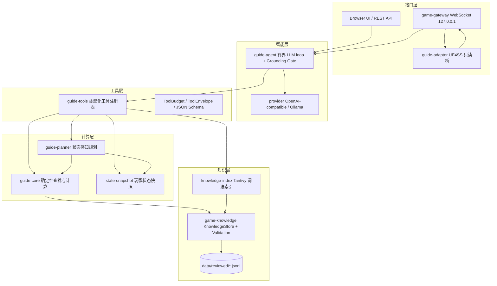
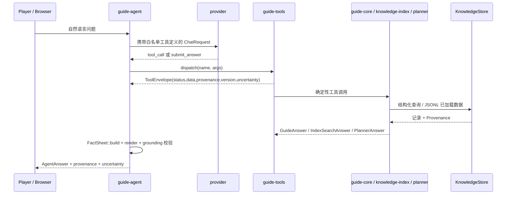
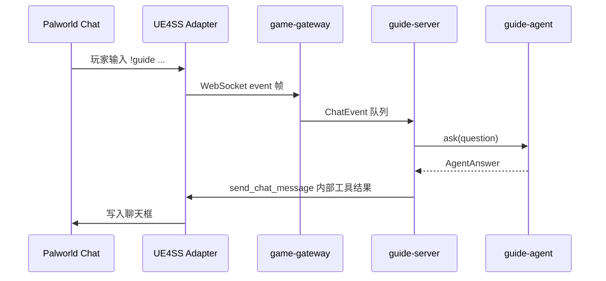

# Palworld Guider 完整设计文档

> 版本：v1.0
> 日期：2026-09-06
> 状态：与仓库当前 G0–G6 实现一致；Release Stage 1 与 Stage 2 已完成，Stage 3 尚未开始。

## 设计目标摘要

Palworld Guider 是一个只读、状态感知的 Palworld 游戏内顾问。它回答物品、材料、帕鲁、配方、繁殖、地图与进度问题，并给出 3–5 个带理由的下一步建议。核心不变量如下：

- **事实来自知识库，不来自 LLM 记忆**：所有游戏事实来自 `data/reviewed/` 下经过审核、带版本和出处的 JSONL。
- **LLM 只负责理解与措辞**：模型选择白名单工具、组织语言，但不能编造事实、数字或繁殖结果。
- **计算必须是 Rust 纯函数**：配方展开、短缺、可制作数量、繁殖链等由 Rust 确定性计算完成。
- **状态感知是显式且可选择的**：只有用户显式导入的状态才会进入规划；原始快照不会直接进入模型提示。
- **始终保持只读边界**：不存在移动、战斗、采集、建造、库存修改或世界写入路径。
- **不确定性必须显式呈现**：缺失、版本不匹配、冲突与陈旧记录返回 `unknown`/`ambiguous` 或明确警告。

---

## 一、痛点分析

### 1.1 为什么这是痛点

Palworld 的信息密度很高，但玩家最需要的“下一步该做什么”往往散落在配方、解锁科技、帕鲁工作适应性、掉落表和地图坐标之间。玩家必须自己拼装这些信息，且经常需要切出游戏查浏览器。

核心痛点可归纳为五类：

1. **上下文切换成本高**：玩家在游戏内发现缺材料，需要切到 Wiki、计算器、地图站或聊天群，再手动回游戏执行。多屏、多标签页和记忆负担都在打断游戏节奏。
2. **数据容易过时或互相矛盾**：Palworld 更新频繁，社区 Wiki 与攻略经常混用不同版本的数据。玩家无法判断“这个配方是否还是当前版本”。
3. **材料依赖难以心算**：许多物品有递归配方和副产品。玩家容易只算第一层材料，漏掉中间产物、批次产出、循环依赖或替代配方。
4. **通用 LLM 会编造数字**：通用聊天助手可以流畅回答，但可能虚构配方比例、掉落概率、坐标或繁殖规则，而且不提供来源，玩家无法复核。
5. **通用工具不理解玩家状态**：Wiki 和数据库只回答公共信息，不结合玩家库存、已解锁科技、队伍与目标，因此无法给出“你现在最值得做的 3 件事”。

### 1.2 具体例子

| 场景 | 玩家实际遇到的问题 |
|---|---|
| 制作物品 | 玩家想做“Air Dash Boots”，需要先知道完整材料树；如果中间材料自身又有多个配方，手工计算很容易漏掉中间产出或算错批次。 |
| 库存短缺 | 玩家有 `N` 个木头、`M` 个石头，想知道还能做几个 Pal Sphere。简单的“各材料除以单件需求”无法正确处理递归材料和副产物。 |
| 多配方歧义 | 同一物品可能有多条已审核配方；直接选第一条会掩盖替代方案，而某些物品被 258、89 条配方引用，正确做法是显式报告歧义而不是猜。 |
| 同名变体 | `Wooden Club` 与 `Bat` 在本地数据中存在身份冲突；稀有度/阶级变体共享显示名，单纯按名称查找会命中多个候选记录。 |
| 繁殖问题 | 玩家问“A + B 会出什么”，如果没有已审核的 `breeding_rule`，系统必须回答 `unknown`，不能靠模型猜遗传规则。 |
| 帕鲁去哪抓 | 玩家想知道某个帕鲁的刷新区域。地图坐标、区域名、最近传送点与 boss 塔之间的关系需要结构化关联，而不是网页搜索碎片。 |
| 进度建议 | 玩家目标是“制作 XX”，但库存缺 3 种材料、队伍缺某种工作适应性，正确建议需要同时看库存、队伍和配方树。 |

### 1.3 现有工具为什么解决不好

| 现有工具 | 典型问题 |
|---|---|
| paldb.cc / Palworld.gg 等数据库 | 覆盖较全，但主要是公共静态页面；不结合玩家状态，缺少可审计的来源版本和冲突提示，无法在游戏内即时回答。 |
| Game8、IGN、GameWith、BWIKI 等攻略站 | 语言、结构和更新时间不一致；配方表与正文可能互相矛盾，复制整页文本还存在版权与数据清洗问题。 |
| 通用聊天助手 | 表达流畅但事实不可靠；会生成看似合理却错误的数字和配方；没有只读游戏状态接入，也不能保证版本敏感。 |
| 游戏内原生教程 | 覆盖基础机制，但不会根据玩家当前库存、队伍和目标提供个性化下一步。 |
| 本地修改器/自动化脚本 | 不是“顾问”而是“控制者”，涉及状态修改和操作风险，与本项目只读边界冲突。 |

本项目不是要取代这些数据库，而是把它们作为“候选来源”，经过注册、提取、审核和版本绑定后，变成一个可离线、可追溯、可个性化、可在游戏内回答的顾问。

---

## 二、场景定制方案

以下是本项目针对“游戏内咨询”这个场景做的专门优化。每一小节都说明为什么需要它，以及技术上是如何实现的。

### 2.1 事实与表达分离：槽位化 Grounding Gate

**场景问题**

LLM 最大的风险不是不会说话，而是会“自信地编造数字”。在攻略场景里，配方数量、坐标、概率、繁殖结果是高风险数据，模型一旦用自然语言直接写出 `3 个木头` 或 `坐标 123, 456`，就失去了确定性保证。

**技术实现**

系统提示词强制模型进入“槽位引用”模式：

- 模型**禁止**写出阿拉伯数字、小数、英文数词、中文数字和序数词。
- 模型只能引用 Rust 预先生成的 `FACT_SHEET` 中的槽位，例如 `{q1}`。
- 最终回答通过 `submit_answer` 工具提交，包含 `status`、`sentences`、`steps`、`slots` 与 `uncertainty`。

Rust 端的工作流如下：

1. `FactSheet::build` 从所有成功工具调用的 JSON 结果中提取四类槽位：
   - `Quantity`：数量/数值，如配方所需数量、短缺量；
   - `Entity`：从工具结果或玩家问题中确认的实体名；
   - `Observation`：运行时 `x/y/z` 坐标；
   - `Version`：当前知识版本与游戏版本信息。
2. 模型草案只写槽位 ID，不写实际值。
3. `answer::render` 在 Rust 中逐槽替换：只有出现在当前 `FACT_SHEET` 且校验通过的槽位才会被渲染成 Rust 格式化的数值。
4. 若草案包含数字词、未知槽位、非法实体名或超长回复，则触发**确定性 fallback**，直接根据 `FactSheet` 生成简短、可核验的回答，而不是回退到模型自由发挥。
5. `AgentAnswer` 返回 `tool_calls`、`provenance`、`version`、`uncertainty`、`errors`，保证每个回答都能审计到工具与知识记录。

这相当于把“数字从哪里来”从模型生成器移到 Rust 校验器，是攻略场景最关键的反幻觉设计。

### 2.2 确定性计算 + 分层检索：LLM 不做算术

**场景问题**

配方展开不是简单的乘法。它需要处理：

- 递归材料依赖；
- 批次产出的向上取整；
- 副产物的净产出与自消耗；
- 循环配方检测；
- 深度上限与整数溢出；
- 一个物品存在多条替代配方时的歧义。

**技术实现**

`guide-core` 的 `GuideEngine` 用 Rust 纯函数完成所有用户可见数量计算：

- `calculate_materials`：递归展开材料树，返回 `MaterialCalculation`。
- `calculate_shortage`：输入库存，返回 `ShortageCalculation` 与逐项缺口。
- `calculate_craftable_count`：在材料树和库存之间求最大可制作数量，并返回限制材料。
- `calculate_breeding_result` / `calculate_breeding_chain`：在没有已审核规则时按设计返回 `unknown`，绝不猜测。

`MaterialNode` 使用 `Raw` / `Recipe` 两类节点保留完整依赖树，`MaterialAcquisition::Recipe` 保存 `recipe_id`、`output_quantity`、`batches`、子节点与副产物，因此答案可以展示“总数如何推导出来”。

检索则按优先级执行，而不是让 LLM 在长文本中找答案：

1. 精确 ID 与别名解析（`resolve_name`）；
2. 结构化实体与关系查询（`get_item`、`get_recipe`、`get_pal_work_suitability` 等）；
3. Tantivy 词法全文检索（`search_structured_knowledge`）；
4. 语义向量检索作为可选扩展，不覆盖结构化事实。

该顺序保证常见问题走确定性的精确路径，模糊问题才退到全文检索，并始终携带出处与置信度。

### 2.3 版本、来源与冲突三态治理

**场景问题**

Palworld 版本迭代会让旧攻略失效。社区数据经常混用版本，且不同来源会对同一事实给出不同值。若系统静默选一个，玩家会得到错误信息却不知道风险。

**技术实现**

- **来源优先序**：本地目标构建导出 > 官方补丁说明/官方文档 > 用户审核的二手来源 > 社区来源。所有来源先注册到 `docs/reference-data/source-log.md`，再允许其事实进入知识库。
- **每条事实内嵌 `Provenance`**：包含 `source_id`、`applicable_game_version`、`retrieved_on`、`reviewer`、`review_status`、`confidence`、`change_risk`。
- **冲突不静默消解**：冲突写入 `ConflictRecord`，记录主题、字段、竞争值、证据来源与解决状态。`get_conflicting_records` 工具向模型和玩家显式暴露冲突。
- **版本检查**：`guide-maintenance version-check` 比较游戏版本、知识版本、索引版本与配置版本；不匹配时回答附带版本警告。
- **陈旧审计**：`audit-stale --game-version X` 列出知识版本与当前游戏版本不一致的记录。

这解决了“旧攻略污染新版本”和“多个来源各说各话”两个典型问题。

### 2.4 只读游戏内 UE4SS 聊天接口

**场景问题**

即使知识引擎再准确，如果玩家必须切出游戏输入问题、再看网页，体验仍被打断。理想状态是玩家在 Palworld 聊天框输入 `!guide ...`，几秒内收到短回答。

**技术实现**

- `guide-server` 与 `game-gateway` 只绑定 `127.0.0.1`，`--host` 非回环值会被拒绝。
- UE4SS 适配器通过带 Bearer Token 的 WebSocket 连接本地网关，使用 schema-2 帧：
  - `hello`、`capability_manifest`、`event`、`tool_call`、`tool_result`、`heartbeat`、`error`。
- 网关限制队列、待处理调用数与消息大小；同一时间只保留一个活动会话，新会话替换旧会话；旧会话的 pending call 会被取消，避免陈旧结果污染回答。
- 适配器对模型只暴露 `get_player_status` 与 `get_active_pal_status` 两个只读工具；`send_chat_message` 是内部工具，**永远不会**进入模型可调用清单。
- 玩家消息通过 `event` 帧进入 `guide-server`，由 `guide-agent` 处理，最终结果通过内部 `send_chat_message` 写回游戏聊天框。

该设计让游戏内咨询成为可能，同时把边界收紧到“只读观察 + 聊天输入输出”。

### 2.5 显式用户状态与个性化规划

**场景问题**

“我现在该做什么”取决于玩家状态：库存、已解锁科技、队伍工作适应性、捕获帕鲁、等级、目标与偏好。公共数据库无法回答这个问题。

**技术实现**

- `state-snapshot` 定义版本化的 `PlayerStateSnapshot`，包含来源类型、同意范围、采集时间、游戏版本、新鲜度、完整性、库存、队伍、科技、捕获帕鲁、等级、目标与偏好。
- 原始快照不会直接进入模型；`SnapshotSummary::for_question(question)` 只提取问题相关字段，例如问库存缺口时给库存摘要，问队伍时给队伍摘要。
- `guide-planner` 的 `GuidePlanner` 基于快照做确定性分析：
  - `InventoryGapAnalysis`：目标材料缺口；
  - `PartyWorkAnalysis`：队伍工作适应性缺口；
  - `CraftableNowAnalysis`：当前库存可制作配方；
  - `GoalReadinessAnalysis`：目标就绪度；
  - `PlannerRecommendation`：3–5 个带分数与理由的下一步。
- 快照 API 只暴露版本、来源类型、游戏版本、新鲜度与缺失字段等元数据，不暴露原始背包、队伍或敏感字段。

这样，状态感知的个性化建议仍是确定性规划，模型只负责把它压缩成聊天友好的短句。

---

## 三、系统架构图

### 3.1 模块划分

工作区由 13 个 Rust crate 组成，按职责分为四层：

| 层 | Crate | 职责 |
|---|---|---|
| 知识层 | `game-knowledge` | 类型化 schema、JSONL 加载与验证、本地构建 intake CLI |
| 知识层 | `knowledge-index` | 基于 Tantivy 的内存词法索引与检索 |
| 计算层 | `guide-core` | 确定性查找、别名解析、配方/短缺/可制作/繁殖/地图计算 |
| 计算层 | `state-snapshot` | `PlayerStateSnapshot` schema、验证、摘要与新鲜度 |
| 计算层 | `guide-planner` | 状态感知的缺口分析与排序推荐 |
| 工具层 | `guide-tools` | 类型化工具注册表、JSON Schema、预算与结果信封 |
| 智能层 | `provider` | OpenAI 兼容与 Ollama provider、超时与错误分类 |
| 智能层 | `guide-agent` | 有界 agent loop、grounding gate、取消与回复长度限制 |
| 接口层 | `guide-server` | 仅回环的 Axum API、浏览器 UI、会话与日志脱敏 |
| 接口层 | `game-gateway` | 认证 schema-2 回环 WebSocket 网关 |
| 接口层 | `guide-adapter` | UE4SS 游戏内聊天桥与运行时工具组合 |
| 运维层 | `guide-maintenance` | 版本检查、知识审计、批量验证 CLI |
| 测试层 | `guide-regression` | 端到端答案回归测试 |

### 3.2 总体架构图



### 3.3 数据流

**离线自然语言问答**



**游戏内聊天**



### 3.4 关键数据结构

| 结构 | 位置 | 作用与关键字段 |
|---|---|---|
| `KnowledgeRecord` | `game-knowledge/src/models.rs` | 带 `record_type` 标签的 18 变体枚举：`Source`、`Item`、`Pal`、`Technology`、`Recipe`、`Habitat`、`BreedingRule`、`Alias`、`ProgressionRelationship`、`Conflict`、`TypeEffectiveness`、`WorkKindDescription`、`Waza`、`PalWazaUnlock`、`MapDefinition`、`MapRegion`、`MapPoint`、`PalHabitatZone` |
| `SourceRecord` | `game-knowledge/src/models.rs` | 来源 ID、标题、供应商、检索日期、证据 URL、适用版本、审核人、审核状态、置信度 |
| `Provenance` | `game-knowledge/src/models.rs` | `source_id`、`applicable_game_version`、`retrieved_on`、`reviewer`、`review_status`、`confidence`、`change_risk` |
| `KnowledgeStore` | `game-knowledge/src/store.rs` | 内存中按 ID/类型建立索引，提供 `item/pal/recipe/alias/map_point/...` 查询 |
| `GuideAnswer<T>` | `guide-core/src/answers.rs` | `status`、`data`、`provenance`、`version`、`uncertainty`、`errors` |
| `MaterialCalculation` | `guide-core/src/calculators.rs` | `target_id`、`requested_quantity`、`tree`、`totals`、`byproducts` |
| `MaterialNode` | `guide-core/src/calculators.rs` | `Raw` 或 `Recipe` 节点；配方节点含 `recipe_id`、`output_quantity`、`batches`、`children`、`byproducts` |
| `ToolDefinition` | `guide-tools/src/lib.rs` | `name`、`description`、`parameters_schema` |
| `ToolEnvelope` | `guide-tools/src/lib.rs` | `status`、`data`、`provenance`、`version`、`uncertainty`、`errors` |
| `ToolBudget` | `guide-tools/src/lib.rs` | 最大调用数、截止时间；每次 dispatch 前校验 |
| `FactSheet` | `guide-agent/src/answer.rs` | 从工具结果提取的 `Quantity/Entity/Observation/Version` 槽位 |
| `AgentAnswer` | `guide-agent/src/lib.rs` | `status`、`answer`、`tool_calls`、`provenance`、`version`、`uncertainty`、`errors` |
| `PlayerStateSnapshot` | `state-snapshot/src/lib.rs` | 来源、同意范围、时间戳、版本、库存、队伍、科技、捕获帕鲁、等级、目标、偏好 |
| `SnapshotSummary` | `state-snapshot/src/lib.rs` | 问题相关摘要；通过 `for_question` 或 `include_all` 生成 |
| `PlannerRecommendation` | `guide-planner/src/lib.rs` | `score`、`basis`、推荐理由、需求与不确定性 |
| `ChatEvent` | `game-gateway/src/lib.rs` | `event_id`、`sequence`、`timestamp_ms`、`source`、`player_id`、`text` |
| `ToolResult` | `game-gateway/src/lib.rs` | `schema_version`、`call_id`、`sequence`、`status`、`data`、`error`、`elapsed_ms` |
| `FrameKind` | `game-gateway/src/lib.rs` | `Hello`、`CapabilityManifest`、`Event`、`ToolCall`、`ToolResult`、`Heartbeat`、`Error` |

### 3.5 数据目录

```text
data/reviewed/
  sources.jsonl                 # 注册来源
  facts.jsonl                   # 早期种子事实与进度关系
  items.jsonl                   # 物品
  pals.jsonl                    # 帕鲁
  recipes.jsonl                 # 配方
  technologies.jsonl            # 科技
  aliases.jsonl                 # 中英别名
  progression_relationships.jsonl
  type_effectiveness.jsonl      # 属性克制
  waza.jsonl                    # 技能
  pal_waza_unlocks.jsonl        # 帕鲁技能解锁
  work_kind_descriptions.jsonl
  maps.jsonl / map_regions.jsonl / map_points.jsonl
  pal_habitat_zones.jsonl       # 帕鲁栖息/刷新区域
```

每个 JSONL 文件都是一条 JSON 对象一行，便于 Git diff、审核和增量维护。当前实现将 JSONL 直接加载进内存；未引入 MySQL/MongoDB，也未把 SQLite 当作事实源。

---

## 四、技术选型

### 4.1 语言与工程基础

| 选择 | 理由 |
|---|---|
| **Rust** | 类型安全、内存安全、无 GC、可离线运行；适合确定性知识引擎、工具注册表和协议边界；可长期作为本地游戏伴生进程。 |
| **Cargo workspace** | 将知识、检索、计算、工具、agent、接口、运维与测试拆成独立 crate，编译边界清晰，避免未来接入游戏状态时耦合。 |
| **serde / serde_json** | 统一 JSONL schema、工具参数、结果信封、快照与协议帧；`derive` 让事实模型与 API 模型共享同一序列化定义。 |
| **thiserror** | 将网关、provider、知识加载与校验的错误建模为结构化错误类型，便于测试和日志。 |
| **chrono** | 处理来源日期、快照时间、新鲜度、日志时间等时间语义，支持 `serde`。 |
| **rand** | 生成会话 ID、请求 ID 等非安全关键随机值。 |

### 4.2 知识检索

| 选择 | 理由 |
|---|---|
| **Tantivy 0.24** | Rust 原生、嵌入式、无外部服务的全文检索库；在内存中建立词法索引，满足离线需求，避免 Elasticsearch/外部搜索服务。 |
| **JSONL 而非 SQLite 作为事实源** | 审核产物需要可 diff、可 review、可版本化；JSONL 最适合作为 canonical artifact。SQLite 最多作为未来派生只读缓存，不成为事实源。 |
| **暂不引入向量数据库** | 精确 ID、结构化查询和 Tantivy 词法检索已覆盖当前需求；语义向量检索作为可选补充，避免在 v1 引入 provider 与嵌入配置复杂度。 |

### 4.3 LLM Provider 与 Agent

| 选择 | 理由 |
|---|---|
| **reqwest 0.12（blocking + rustls-tls）** | 供 OpenAI 兼容接口与 Ollama 使用；阻塞客户端在单请求 provider 适配器中更简单，`rustls-tls` 避免依赖系统 OpenSSL，便于跨机器构建。 |
| **自定义 `provider` 契约** | `ChatProvider` 抽象 OpenAI 兼容与 Ollama 两类后端；支持 `ToolSpec`、`ToolRequest`、超时与 `ProviderError`，让 agent 不绑定具体厂商。 |
| **MockProvider** | 在测试中脚本化 provider 响应，稳定复现工具调用、超时、失败和 grounding 场景，不依赖网络。 |
| **有界 agent loop** | `guide-agent` 固定最大工具调用轮数与总超时；模型选择工具，但事实、算术与最终数值渲染留在 Rust。 |

### 4.4 Web 与游戏接口

| 选择 | 理由 |
|---|---|
| **tokio 1** | Axum 的异步运行时；多线程 runtime 支持并发 API 请求、会话与网关任务。 |
| **axum 0.8 + tower-http limit** | 轻量、类型安全的路由与提取器；`tower-http` 限制请求体大小，避免资源滥用。 |
| **tungstenite 0.28** | 纯 Rust WebSocket 实现；gateway 只需回环单客户端连接，同步 tungstenite 比引入完整异步 WS 栈更直接。 |
| **仅回环绑定** | Web 服务与网关只监听 `127.0.0.1`，从网络边界上禁止公网暴露；UE4SS 适配器在同一台机器连接。 |

### 4.5 状态与规划

| 选择 | 理由 |
|---|---|
| **`state-snapshot` 独立 crate** | 将动态状态与静态知识解耦；未来 G4/G5 增加存档副本、REST API 或 UE4SS 字段时，只需扩展归一化后的 `PlayerStateSnapshot`，不触碰知识层。 |
| **`guide-planner` 独立 crate** | 规划是产品核心差异化能力，但必须可独立测试；缺口分析、打分与推荐排序全部为 Rust 纯函数，测试不依赖 LLM。 |

### 4.6 运维与回归

| 选择 | 理由 |
|---|---|
| **`guide-maintenance` CLI** | 提供 `version-check`、`audit-sources`、`audit-conflicts`、`audit-stale`、`validate-batch`，把知识维护变成可审计操作，而不是人工翻文件。 |
| **`guide-regression` crate** | 42 个端到端回归测试覆盖查找准确性、计算正确性、检索命中率、幻觉率与版本警告，防止后续知识更新悄悄破坏答案。 |
| **`cargo fmt` / `clippy -D warnings` / `cargo test`** | 作为提交前硬门槛；当前工作区 327 个测试全部通过，`git diff --check` 无问题。 |

### 4.7 关键取舍

- **事实源与模型解耦**：宁可在 provider 调用中多一次 Rust 校验，也不让模型直接输出数字。这个取舍牺牲少量生成灵活性，换取可审计与低幻觉。
- **v1 不引入网络数据库与向量服务**：用 JSONL + 内存索引 + Tantivy 把部署复杂度压到最低，先验证“离线有用”的产品假设。
- **接口先本地化**：先通过回环 Web/UE4SS 验证单机体验，再谈 G5+ 的其他动态来源；公网服务、多玩家路由和更复杂的服务器 API 全部留给后续 spec。

---

## 附：当前实现边界

- 当前已完成 G0–G6：Release Stage 1（公共静态信息 agent）与 Release Stage 2（单用户显式状态指南）代码已实现，离线构建、Clippy 与测试通过。
- 当前范围是显式、只读、单用户状态感知指南；Stage 3 私有多人指南仍需单独 specification。
- 游戏集成保持只读：UE4SS 只观察玩家位置与当前骑乘/召唤帕鲁身份，不读取库存、队伍、存档、附近角色，也不执行任何移动、战斗、采集、建造或库存修改。
- 知识覆盖质量是持续维护项：部分多配方物品的确定性计算会返回显式歧义；同名稀有度变体需要消歧；繁殖规则未审核时按设计返回 `unknown`；这些不确定性在最终回答中会被如实报告。
- 自 2026-09-07 起，`guide-agent` 对每个问题先做确定性 grounding：自动抽取候选实体、执行 `resolve_name` 与 `get_item`/`get_pal`/`get_technology` 精确查找，并注入紧凑检索摘要；纯事实问题无需模型精确选择专用工具即可正常作答，计算与数值仍走确定性工具 slot。
